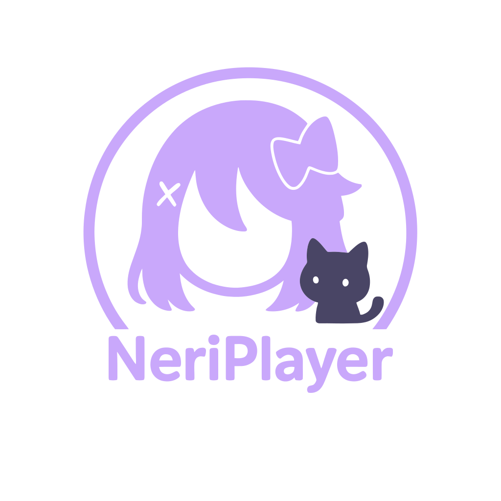

<h1 align="center">NeriPlayer (音理音理!)</h1>

<h3>✨ 简易多平台音视频聚合流媒体播放器 🎵</h3>

  

  

  

本项目的名称及图标灵感来源于《星空鉄道とシロの旅》中的角色「风又音理」。

项目采用原生 Android 开发，目前仅适配 Android 9+ 设备，并遵循 Material You 设计理念。

🚧 **Work in progress / 开发中**

> [!WARNING]  
> 本项目仅供学习与研究使用，请勿将其用于任何非法用途。

---

# Features / 功能特性
- 支持 **网易云音乐** 和 **哔哩哔哩** 的本地歌单混合播放，突破版权限制
- `本地歌单` 与 `平台歌单` 在线预览，可快速导入/导出所选音乐
- `本地歌单` 支持音乐的**排序**与**删除**
- 蓝牙/有线设备断开时自动暂停播放
- 播放模式：随机 / 顺序 / 歌单循环 / 单曲循环
- 播放源显示
- 逐字歌词显示
- 播放页面背景随音乐律动
- 歌曲信息匹配
- 音频缓存（上限 10GB）
- 封面缓存

> [!NOTE]  
> 为保护音乐版权并保障您的使用权益，本软件的音频服务依赖您在第三方平台的账号授权。  
> 会员专属内容仍需遵循原平台的会员规则。

---

# TODO / 未来展望
- 视频播放
- 评论区
- 清理缓存
- 音频下载
- ~~云存储~~（维护成本过高，暂不考虑）
- 添加到播放列表
- 平板适配
- 歌词悬浮窗
- 国际化

---

# Bug Report / 问题反馈
在反馈问题前，请先开启调试模式（设置界面点击 **版本号** 7 次）。  
然后前往 [Issues](https://github.com/cwuom/NeriPlayer/issues) 按模板提交问题报告。

---

# Adaptation Status / 平台适配情况
- [x] 网易云音乐 / NetEase Cloud Music
- [x] 哔哩哔哩 / BiliBili
- [ ] YouTube
- [ ] QQ 音乐 / QQ Music
- [ ] 酷狗音乐 / KuGoo

> ⚠️ QQ 音乐的授权有效期过短，无法长期使用。  
> 如果您有可行的解决方案，请在 `Issues` 中提出，我们会尽快评估并适配。

---

# Known Issues / 已知问题
### 网易云音乐 API
- 歌单详情接口存在获取上限，目前最多只能获取 1000 首歌曲。
- 或许可通过 `/weapi/v3/playlist/detail` 替代 `/api/v6/playlist/detail` 解决，但考虑到大部分歌单不超过 1000 首歌曲，目前仍采用 `/api/v6/playlist/detail`。
- 若有更大需求，后续会考虑调整。
### 网络
- 目前已知开启代理会有部分平台（如网易云）搜索失效，加载缓慢，歌曲无法波播放等问题。
- 开启 `绕过系统代理` 功能时好时坏，覆盖不全

---

# Privacy / 隐私与数据
- 本软件仅作为跨平台音视频聚合工具，不上传、不分发、不修改任何音视频文件；也不会在服务器侧存储用户或第三方内容。
- 不收集任何 **个人身份信息**；
- 不收集任何 **设备信息**；
- 不进行行为跟踪、分析或用户画像；
- 播放记录、搜索记录等仅保留在本地；
- 下载文件仅保存至本地，不会上传或回传开发者/第三方；
- 不接入第三方统计、崩溃分析或广告 SDK；
- 第三方平台访问日志由相应平台根据其隐私政策处理。

---

# Reference / 鸣谢
<table>
<tr>
  <td><a href="https://github.com/chaunsin/netease-cloud-music">netease-cloud-music</a></td>
  <td>✨ 网易云音乐 Golang 实现 🎵</td>
</tr>
<tr>
  <td><a href="https://github.com/SocialSisterYi/bilibili-API-collect">bilibili-API-collect</a></td>
  <td>哔哩哔哩-API收集整理【不断更新中....】</td>
</tr>
<tr>
  <td><a href="https://github.com/ReChronoRain/HyperCeiler">HyperCeiler</a></td>
  <td>HyperOS enhancement module - Make HyperOS Great Again!
</td>
</tr>
</table>

---

# Update Cycle / 更新周期
- 因学业原因，更新频率不定。
- 仅维护核心功能，其他功能交由社区贡献。
- 本仓库可能因特殊原因随时停止更新。
- 欢迎大家提交 PR！

---

# Support / 支持
- 由于项目特殊性，暂不接受任何形式的捐赠。
- 若您能参与到开发与优化中，这就是对我们最大的支持。

---

# License / 许可证
NeriPlayer 使用 **GPL-3.0** 开源许可证发布。

这意味着：
- ✅ 你可以自由地使用、修改和分发本软件；
- ⚠️ 如果你分发修改后的版本，必须同样以 GPL-3.0 协议开源；
- 📚 详细条款请参阅 [LICENSE](./LICENSE) 文件。

---

# Contributing to NeriPlayer / 贡献指南
感谢你愿意为 NeriPlayer 做出贡献！本指南将帮助你快速上手开发、提交修改和参与讨论。请在提交 PR 前阅读完 [CONTRIBUTING.md](./CONTRIBUTING.md)

---

  
   
  

