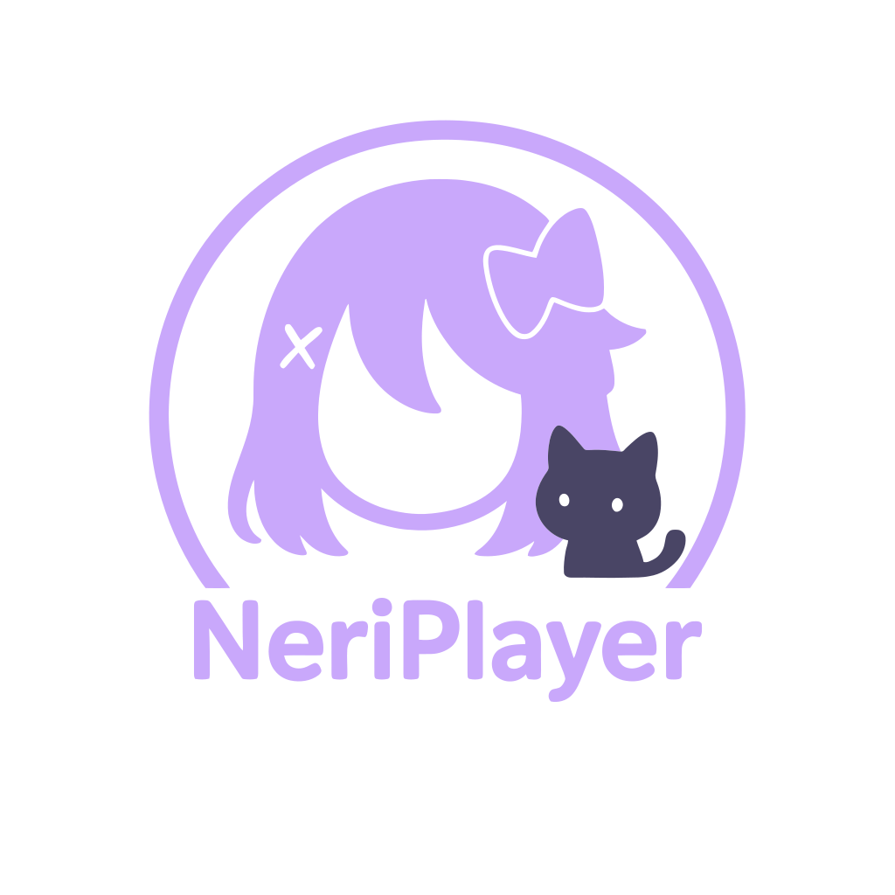

[English](./README_EN.md) | [中文](./README.md)

<h1 align="center">NeriPlayer</h1>

<div align="center">

<h3>✨ Native Android Multi-Source Audio Player 🎵</h3>

<p>
  <a href="https://t.me/ouom_pub">
    
  </a>
</p>

<p>
  <a href="https://t.me/neriplayer_ci">
    
  </a>
</p>

<p>
  
</p>

<p>
The project's name and icon are inspired by the character "Kazamata Neri" from "星空鉄道とシロの旅".
</p>

<p>
This project is developed natively for Android, currently supporting Android 9 (API 28) and above.
It continuously iterates around "multi-source exploration, online playback, and local control".
</p>

🚧 <strong>Work in progress</strong>

<a href="https://trendshift.io/repositories/23906" target="_blank"></a>

</div>

> [!WARNING]
> This project is for learning and research purposes only. Please do not use it for any illegal purposes.

---

> [!NOTE]
> NeriPlayer does not provide public cloud-based music libraries or media distribution services.
> Online audio capabilities rely on your account authorization on third-party platforms.
> VIP or restricted content must still comply with the original platform's rules.

---

## About
NeriPlayer is a native Android audio player based on **Jetpack Compose + Media3**.
The current focus is not to build a public cloud service, but to integrate online content from **NetEase Cloud Music**, **Bilibili**, and **YouTube Music** under the premise that the user already has third-party platform accounts. It also provides features like **streaming cache, in-app downloads, local imports, local playlist management, and optional GitHub private repository sync**.

- **Account as Capability**: By legally authorizing your third-party platform accounts, you enable online playback, searching, and playlist access.
- **Local Storage by Default**: Playback cache, downloaded files, playlists, history, settings, and authorization info are saved locally on the device by default.
- **Optional Private Repo Sync**: Metadata such as playlists, favorites, and history can be synced to your own GitHub private repository.
- **Single Activity + Compose Architecture**: `MainActivity` is the sole entry point, organizing the UI via Compose `NavHost`, Mini Player, and Now Playing overlay.
- **Initial Disclaimer Phase**: The app startup flow is `Loading -> Disclaimer -> Main`. First-time users must read and agree to the disclaimer.

---

## Getting Started
### a. Download Release Version (Recommended)
1. Go to [GitHub Release](https://github.com/cwuom/NeriPlayer/releases)
2. How to choose a version?
   - Most users should download the arm64-v8a version.
   - For older phones (32-bit systems), download the armeabi-v7a version.
   - x86 / x86_64 versions are intended solely for emulators/Intel devices/Chromebooks.

### b. Download CI Version
1. Go to [GitHub Actions](https://github.com/cwuom/NeriPlayer/actions), download the Artifacts of the latest successful build, and extract it.
2. Alternatively, visit [NeriPlayer CI Builds](https://t.me/neriplayer_ci).

> CI only builds the arm64-v8a version.

### c. Local Build
1. Clone the repository and open it in Android Studio (latest stable version):
   ```bash
   git clone https://github.com/cwuom/NeriPlayer.git
   cd NeriPlayer
   ```
2. Sync dependencies.
3. Build the debug version:
   ```bash
   ./gradlew :app:assembleDebug
   ```
4. Install the APK (Android 9+ device required):
   ```bash
   adb install -r app/build/outputs/apk/debug/app-debug.apk
   ```
5. Read and agree to the disclaimers upon the first launch. For Android 13+ devices, the app will request notification permissions.
6. For utilizing internal debugging functions: tap the **version number** 7 times in Settings to enable developer mode, which spawns an isolated `Debug` page in the bottom bar.

> DEBUG configurations may have performance issues and are intended solely for testing purposes.

For release build and signature setup, please consult [CONTRIBUTING.md](./CONTRIBUTING_EN.md#release-build).

---

## Key Features
- 🎧 **Multi-Source Exploration and Playback**: The `Explore` page currently supports browsing curated NetEase playlists and YouTube Music playlists, and provides search portals for **NetEase Cloud Music / Bilibili / YouTube Music**.
- 🔍 **Layered Search Capabilities**: Page searching and playback metadata completion are two separate flows. `Explore` uses **NetEase / Bilibili / YouTube Music**; `SearchManager` uses **NetEase / QQ Music** to complete cover art, lyrics, and track info.
- 🧠 **Media3-based Custom Playback Manager**: `PlayerManager` handles stream parsing, playlist queues, shuffle/looping, state persistence, failure retry, and recovery.
- 💾 **Configurable Streaming Cache**: The player uses `SimpleCache + LRU` for audio caching, with a default limit of **1 GB**. Allows manual cache clearing in settings.
- ⬇️ **In-App Downloads and Local Playback**: Supports downloading online audio sources to the app's dedicated directory, saving lyrics and covers synchronously, and allowing you to view progress and manage downloaded songs within the app.
- 📁 **Local Audio Import and Scanning**: Supports `VIEW / SEND / SEND_MULTIPLE` for `audio/*` via the system, allowing audio import after external sharing/opening. Also supports scanning local audio on the device.
- ☁️ **GitHub Private Repository Sync**: Optional syncing of local playlists, favorite playlists, recent play history, and deletion records using `WorkManager` for delayed and periodic syncing.
- 🛠️ **Developer Mode and Debug Tools**: Tap the version number **7 times** in settings to reveal an independent `Debug` page in the bottom bar, containing probes for YouTube / Bili / NetEase / Search API, general logs, and a crash log viewer.
- 🌈 **Audio-Reactive Dynamic Background**: On the Now Playing screen (Android 13+), you can optionally enable an audio-reactive background effect based on `RuntimeShader`.
- ♻️ **Local Backup and Restore**: Supports local JSON import/export of playlists and favorites for device migration or manual backup.
- 🎧 **Listen Together**: Supports creating or joining rooms for real-time WebSocket playback synchronization, independent room permission control (Host/Listener), and host offline detection.

---

## Listen Together Deployment
NeriPlayer has a built-in "Listen Together" feature. You can quickly deploy your own server or use servers deployed by others.
Server repository: [TheSmallHanCat/NeriPlayer-LTW](https://github.com/TheSmallHanCat/NeriPlayer-LTW) or the `np-submodule/NeriPlayer-LTW` submodule in this repository.

The server is based on **Cloudflare Workers** and **Durable Objects**, providing ultra-low latency WebSocket real-time synchronization.

### Deploy to Cloudflare Workers
[](https://deploy.workers.cloudflare.com/?url=https://github.com/TheSmallHanCat/NeriPlayer-LTW)

---

## Platform Status
- **NetEase Cloud Music**: Login, search, curated playlist/album access, playback, downloads, lyrics completion.
- **Bilibili**: Login, search, favorites access, multi-part video-to-audio playback, downloads.
- **YouTube Music**: Login, playlist browsing/details, playback, downloads; registered as a search source in Explore.
- **QQ Music**: Currently solely used for playback metadata/lyrics completion. Login, playback, and library features are not implemented yet.

---

## Implementation Notes
### Build and Versions
- `compileSdk = 36`
- `targetSdk = 36`
- `minSdk = 28`
- Java 17 / Kotlin JVM 17
- Version name format: `<git_short_hash>.<MMddHHmm>`
- Release APK filename: `NeriPlayer-<versionName>.apk`

### Entry Point and Navigation
- The only external entry point is `MainActivity`, which handles app startup and external audio imports.
- The startup flow includes a disclaimer phase; Android 13+ requests notification permissions on the first launch.
- The main UI is built using **Compose NavHost + Dynamic Bottom Bar**: `Home / Explore / Library / Settings` form the primary paths.
- `Home` is only displayed if feed cards are enabled; `Debug` is only displayed after enabling developer mode.
- `Now Playing` is not a standard route but a full-screen playback layer over the main navigation, with a persistent `Mini Player` at the bottom.

### Playback, Caching, and Services
- Playback core is based on Media3 ExoPlayer, centrally managed by `PlayerManager`.
- `AudioPlayerService` provides a foreground playback service, media notifications, and basic transport controls.
- Bilibili audio playback uses `ConditionalHttpDataSourceFactory` to dynamically append `Referer / User-Agent / Cookie`.
- Playback states are periodically persisted for queue and state recovery upon app restarts.

### Search and Data Sources
- **UI Search**: Currently integrates **NetEase, Bilibili, and YouTube Music**. Searches are platform-specific and do not aggregate results.
- **Metadata Completion**: Underlying processes rely on **NetEase and QQ Music** exclusively for completing cover art, lyrics, and track metadata across different sources during playback.
- ⚠️ **QQ Music** currently acts strictly as a background metadata provider. Its Library entry remains an inactive placeholder.

### Local Data and Security
- **App settings** are persisted using `DataStore`.
- **Platform Cookies, auth configurations, and GitHub Tokens** are securely stored locally via **Android Keystore + EncryptedSharedPreferences**.
- Play histories, playlists, favorite snapshots, and specific mappings are persisted via local files.
- Local playlists are stored via JSON files and achieve atomic writes via temporary swappable files.
- GitHub sync utilizes locally generated UUIDs as device identifiers instead of relying on `ANDROID_ID`.

### Downloads, Imports, and Backups
- Downloads utilize a single shared `OkHttpClient`, avoiding the system `DownloadManager`.
- Downloaded files reside within a dedicated app directory and save matching lyrics and cover arts synchronously.
- `LocalAudioImportManager` handles importing external tracks and copies nearby `lrc/txt` texts alongside `cover/folder/front` album images.
- `BackupManager` orchestrates diff-based manual JSON deployments internally alongside standardized exportation pipelines.

Want to learn more about the implementation details? Please read [CONTRIBUTING_EN.md](./CONTRIBUTING_EN.md).

---

## GitHub Sync
NeriPlayer supports syncing local metadata to **your own GitHub private repository**. The primary sync targets include:

- Local playlists
- Favorite playlists
- Recently played records
- Recently played deletion records

### Technical Details
- 🔒 **Local Secure Storage**: GitHub Tokens are kept safely in `Android Keystore + EncryptedSharedPreferences`.
- 🔄 **Sync Scheduling**: Local data modifications trigger an operation **delayed by 5 seconds**; a continuous **hourly** periodic cycle is also enforced.
- ⏱️ **Eventual Consistency**: Expect standard background two-way syncing rather than definitive real-time metric pushes.
- 🌐 **Network Requirements**: Syncing banks upon `WorkManager`, activating solely underneath **validated network** settings.
- 🧩 **Conflict Resolving**: Standard tri-directional matching occurs for playlists, histories, favorites, and wipe parameters.
- 🧯 **Conflict Borders**: Automatic built-in logic mitigates standard crashes. Manual resolution interfaces remain absent.
- 🪶 **Data Saver**: Operational sync modules possess natively enforced Data Saver parameters defaulting to active.
- 📦 **Remote Formatting**: Archival datasets operate upon plaintext JSON logic or compressed bin strings. Utilizing GitHub private repositories remains disparate from definitive end-to-end encryption.
- 🚫 **Sync Borders**: We purely harmonize basic metadata values. Media playback cache, physical downloaded files, standalone external configurations, native cookies and token chains remain strictly localized.

### How to Use
1. Enter the GitHub Sync menu within Settings.
2. Create a standard GitHub Personal Access Token (requiring the `repo` permission).
3. Validate and specify the preferred sync destination via the app interface.
4. Toggle automatic syncing on.

---

## Roadmap
- [ ] Video playback
- [ ] Comment section
- [x] Clear cache
- [x] Add to playlist
- [x] Tablet adaptation
- [ ] Floating lyrics
- [x] Internationalization
- [x] NetEase Cloud Music adaptation
- [x] Bilibili adaptation
- [x] YouTube Music basic adaptation
- [x] YouTube Music search capabilities
- [ ] Continuous extension for third-party platforms

> ⚠️ Currently, QQ Music is primarily used for playback page metadata completion.
> Complete account functionalities, library page data, and more stable authorization pipelines remain deep within developmental scopes.

---

## Bug Report
- Always prioritize booting into developer mode explicitly before articulating functional breakdowns. (Tap **version number** 7 times under Settings).
- Following activation: standard baseline log tracking initiates independently. Complete system breakdown registers trigger immediate isolated external logs.
- Access the [Issues](https://github.com/cwuom/NeriPlayer/issues) section. Present critical systematic variables like localized OS models, explicit application versions, reproduction instructions, alongside core diagnostic parameter logs.
- Windows-based terminal tracking:
  ```bash
  adb logcat | findstr NeriPlayer
  ```
- macOS / Linux iteration:
  ```bash
  adb logcat | grep NeriPlayer
  ```

---

## Known Issues
### Network
- Configure proxy implementations diligently. Submerging completely under external routing nodes frequently shatters internal standard third-party structural returns.

### Limitations
- The integrated overarching download mechanisms isolate system dependencies. Re-establishment hooks on aborted download strings remain completely inactive currently.
- `Bilibili` strictly functions as an expedited search/audio conversion hook currently. Comprehensive generalized audio discovery branches aren't natively supported yet.

---

## Privacy
- NeriPlayer explicitly avoids providing analytical cloud distributions. It fundamentally evades encompassing localized tracking analytic systems, invasive programmatic advertising components, and third-party crash evaluation SDKs.
- General operational configurations, encompassing internal downloaded variables, user preferences, explicit platform credentials, historical playthroughs, alongside audio caches invariably default to native local storage environments.
- For instances enabling explicit GitHub integrations, standard operations exclusively port standalone playlist variants alongside superficial metadata attributes straight into your privatized Git external repository.
- Streaming credential variants, extensive cookie caches, complete file outputs, alongside audio logs are NOT uploaded to developers.
- System cloud/device backup is disabled by default. Use the built-in JSON export/import flow when you need a manual backup or migration path.
- Access logs and risk control strategies on the third-party platform side are handled by the corresponding platforms in accordance with their respective privacy policies.

---

## Reference
<table>
<tr>
  <td><a href="https://github.com/chaunsin/netease-cloud-music">netease-cloud-music</a></td>
  <td>✨ NetEase Cloud Music Golang Implementation 🎵</td>
</tr>
<tr>
  <td><a href="https://github.com/SocialSisterYi/bilibili-API-collect">bilibili-API-collect</a></td>
  <td>Bilibili API Collection and Organization</td>
</tr>
<tr>
  <td><a href="https://github.com/yt-dlp/ejs">ejs</a></td>
  <td>External JavaScript for yt-dlp supporting many runtimes</td>
</tr>
<tr>
  <td><a href="https://github.com/cwuom/accompanist-lyrics-core">accompanist-lyrics-core</a></td>
  <td>A lyrics parsing, converting, exporting library for Kotlin</td>
</tr>
<tr>
  <td><a href="https://github.com/cwuom/accompanist-lyrics-ui">accompanist-lyrics-ui</a></td>
  <td>The state-of-the-art karaoke lyrics composable</td>
</tr>
<tr>
  <td><a href="https://github.com/ReChronoRain/HyperCeiler">HyperCeiler</a></td>
  <td>HyperOS enhancement module - Make HyperOS Great Again!</td>
</tr>
</table>

---

## Update Cycle
- We only maintain core features. Other capabilities welcome community contributions.
- Development may be paused at times due to special reasons.
- PRs and feedback are welcome.

---

## Support
- Due to the nature of this project, we do not accept any form of donations.
- You can support the project by submitting Issues, PRs, or sharing your experience.

---

## License
NeriPlayer is published under the **GPL-3.0** open source license.

This means:
- ✅ You can freely use, modify, and distribute this software.
- ⚠️ Modifications must be distributed under the same GPL-3.0 license.
- 📚 Read details in [LICENSE](./LICENSE).

---

# Contributing to NeriPlayer
Before contributing, please read the complete [CONTRIBUTING_EN.md](./CONTRIBUTING_EN.md).

---

<p align="center">
  
  <br/>
  <a href="https://starchart.cc/cwuom/NeriPlayer">
    
  </a>
</p>
